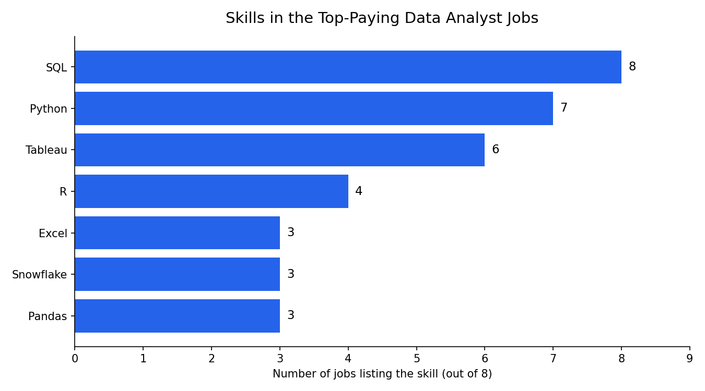
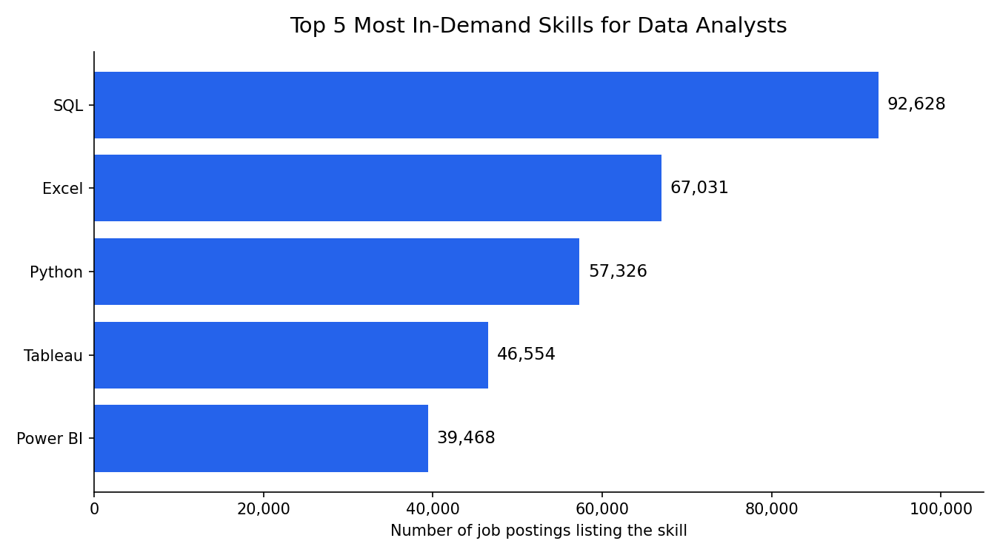
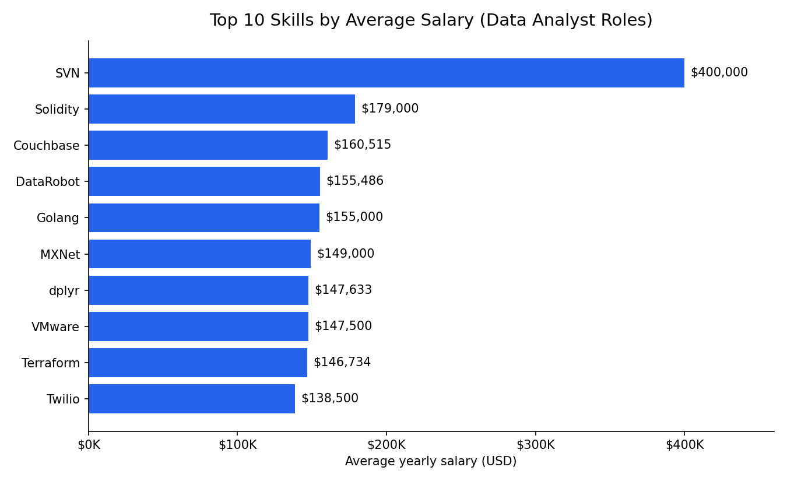

## Introduction

Dive into the data job market! Focusing on data analyst roles, this project explorestop-paying jobs, in-demand skills, and where high demand meets high salary in data analytics.

- SQL queries? Check them out here: [project_sql folder](/project_sql/)

# Background
Driven by a quest to navigate the data anayst job market more effectively, this project was born from a desire to pinpoint top-paid and in-demand skills, streamlining others work to optimal jobs.

## The questions I wanted to answer through my queries were:
1. What are the top-paying data analyst jobs?
2. What skills are required for these top-paying jobs?
3. What skills are most in demand for Data Analysts?
4. Which skills are associated with higher salaries?
5. What are the most optimal skills to learn?

# Tools I Used
For my deep dive into the data analyst job market, I harnessed the power of several key tools:

- **SQL**: The background of my analysis, allowing me to query the database and unearth critical insights.
- **PostgresSQL**: The chosen database management system, ideal for handling the job postings data.
- **Visual Studio Code**: My go-to for database managemnt and handling SQL queries.
- **Git and Github**: Essential for version control and sharing my SQL Scripts and analysis, ensuring collaboration and project tracking.
# The Analysis
Each query for this project aimed at investigating specific aspects of the data analysis job market. Here is how I approached the question: 
### 1. Top Paying Data Analyst Jobs
To identify the highest paying roles, I filtered data analyst positions by average yearly salary and location. This query highlights the high paying opportunities in the field.

```sql
    SELECT
    job_id,
    job_title,
    job_location,
    job_schedule_type,
    salary_year_avg,
    job_posted_date,
    name AS company_name
FROM
    job_postings_fact
LEFT JOIN company_dim ON job_postings_fact.company_id = company_dim.company_id
WHERE
    job_title_short = 'Data Analyst' AND
    job_location = 'Anywhere' AND
    salary_year_avg IS NOT NULL
ORDER BY
    salary_year_avg DESC
LIMIT 10;
```
Here is the breakdown:
- **Wide Salary Range:** The top paying data analyst roles span from $184000 to $650000 indicatingsignificant salary potential.
- **Diverse Employers:** Companies like SmartAsset, Meta, and AT&T are among those offering high salaries, showing a broad interest across different industries.
- **Job Title Variety:** There is a high diversit of job Titles, from Data Analyst to Director of Analytics, reflecting varied roles and specialisations with data analytics.

### 2. Top Paying Job Skills

### 2. Top Paying Job Skills
To understand what skills the highest-paying roles ask for, I joined the top 10 jobs from the first query with the skills data. This shows what employers value most for top-compensated roles.

```sql
WITH top_paying_jobs AS (
    SELECT
        job_id,
        job_title,
        salary_year_avg,
        name AS company_name
    FROM
        job_postings_fact
    LEFT JOIN company_dim ON job_postings_fact.company_id = company_dim.company_id
    WHERE
        job_title_short = 'Data Analyst' AND
        job_location = 'Anywhere' AND
        salary_year_avg IS NOT NULL
    ORDER BY
        salary_year_avg DESC
    LIMIT 10
)

SELECT
    top_paying_jobs.*,
    skills
FROM top_paying_jobs
INNER JOIN skills_job_dim ON top_paying_jobs.job_id = skills_job_dim.job_id
INNER JOIN skills_dim ON skills_job_dim.skill_id = skills_dim.skill_id
ORDER BY
    salary_year_avg DESC;
```

Here is the breakdown of the most demanded skills among the top-paying data analyst jobs:
- **SQL** is the most requested skill, appearing in all 8 jobs with skills listed.
- **Python** follows closely, appearing in 7 of 8 jobs.
- **Tableau** is the preferred visualization tool (6 of 8), well ahead of Power BI (2 of 8).
- **R**, **Pandas**, **Excel**, and **Snowflake** show up in 3-4 jobs each, pointing to the value of statistical, data wrangling, and cloud data warehouse skills.


*Bar chart of how often each skill appears in the top-paying data analyst job postings.*

| Skill | Jobs (of 8) |
|-------|-------------|
| SQL | 8 |
| Python | 7 |
| Tableau | 6 |
| R | 4 |
| Excel | 3 |
| Snowflake | 3 |
| Pandas | 3 |

> **Note:** 2 of the top 10 jobs have no skills listed in the dataset, so they drop out of the skills join. The counts above cover the remaining 8.

### 3. In-Demand Skills for Data Analysts
This query counts how often each skill appears across all Data Analyst postings, to show which skills employers ask for most.

```sql
SELECT
    skills,
    COUNT(skills_job_dim.job_id) AS demand_count
FROM job_postings_fact
INNER JOIN skills_job_dim ON job_postings_fact.job_id = skills_job_dim.job_id
INNER JOIN skills_dim ON skills_job_dim.skill_id = skills_dim.skill_id
WHERE
    job_title_short = 'Data Analyst'
GROUP BY
    skills
ORDER BY
    demand_count DESC
LIMIT 5;
```

Here is the breakdown of the most demanded skills for data analysts:
- **SQL** is the most requested skill by a clear margin, appearing in 92,628 postings. It is the foundation of data analyst work.
- **Excel** ranks second with 67,031 postings, showing that spreadsheets remain essential for everyday analysis and reporting.
- **Python** is third with 57,326 postings, reflecting the growing expectation of programming for analysis and automation.
- **Tableau** and **Power BI** complete the top five with 46,554 and 39,468 postings, confirming that data visualization tools are a core requirement.

| Skill | Demand Count |
|-------|--------------|
| SQL | 92,628 |
| Excel | 67,031 |
| Python | 57,326 |
| Tableau | 46,554 |
| Power BI | 39,468 |

*Table of the demand for the top 5 skills in data analyst job postings.*


*Bar chart of the top 5 most in-demand skills for data analysts.*

### 4. Top Paying Skills
This query calculates the average yearly salary associated with each skill across Data Analyst postings that list a salary. It shows which skills are linked to the highest pay.

```sql
SELECT
    skills,
    ROUND(AVG(salary_year_avg), 0) AS avg_salary
FROM job_postings_fact
INNER JOIN skills_job_dim ON job_postings_fact.job_id = skills_job_dim.job_id
INNER JOIN skills_dim ON skills_job_dim.skill_id = skills_dim.skill_id
WHERE
    job_title_short = 'Data Analyst'
    AND salary_year_avg IS NOT NULL
GROUP BY
    skills
ORDER BY
    avg_salary DESC
LIMIT 25;
```

Here is the breakdown of the results for top paying skills for data analysts:
- **Niche and engineering skills pay the most.** Solidity ($179,000), Golang ($155,000), and Couchbase ($160,515) sit near the top, showing a premium for specialized development and database skills.
- **DevOps and cloud tooling is strongly rewarded.** Terraform ($146,734), VMware ($147,500), Puppet ($129,820), Ansible ($124,370), and GitLab ($134,126) point to employers paying more for analysts who can work with infrastructure.
- **Machine learning frameworks command high salaries.** DataRobot ($155,486), MXNet ($149,000), Keras ($127,013), PyTorch ($125,226), Hugging Face ($123,950), and TensorFlow ($120,647) all land in the top 25.
- **Data engineering tools are well paid.** Kafka ($129,999), Airflow ($116,387), Cassandra ($118,407), and Scala ($115,480) show that pipeline and big data skills lift salaries.
- **dplyr ($147,633)** stands out for analysts, suggesting that R-based data manipulation is valued.
- **SVN ($400,000) is an outlier.** It is most likely driven by a very small number of postings, so I would not read it as a real salary signal.

| Skills | Average Salary ($) |
|--------|-------------------:|
| SVN | 400,000 |
| Solidity | 179,000 |
| Couchbase | 160,515 |
| DataRobot | 155,486 |
| Golang | 155,000 |
| MXNet | 149,000 |
| dplyr | 147,633 |
| VMware | 147,500 |
| Terraform | 146,734 |
| Twilio | 138,500 |

*Table of the average salary for the top 10 paying skills for data analysts.*


*Bar chart of the average salary for the top 10 paying skills for data analysts.*

> **Note:** Averages are based on postings with a listed salary, and some skills may appear in only a handful of postings, so rare skills can look better paid than they are.

### 5. Most Optimal Skills to Learn
By combining demand and salary data, this query pinpoints skills that are both in high demand and well paid, to give job seekers a focused list of skills to learn. It keeps only skills with more than 10 postings, so a handful of listings can't distort the averages.

```sql
WITH skills_demand AS (
    SELECT
        skills_dim.skill_id,
        skills_dim.skills,
        COUNT(skills_job_dim.job_id) AS demand_count
    FROM job_postings_fact
    INNER JOIN skills_job_dim ON job_postings_fact.job_id = skills_job_dim.job_id
    INNER JOIN skills_dim ON skills_job_dim.skill_id = skills_dim.skill_id
    WHERE
        job_title_short = 'Data Analyst'
        AND salary_year_avg IS NOT NULL
    GROUP BY
        skills_dim.skill_id
), average_salary AS (
    SELECT
        skills_dim.skill_id,
        ROUND(AVG(salary_year_avg), 0) AS avg_salary
    FROM job_postings_fact
    INNER JOIN skills_job_dim ON job_postings_fact.job_id = skills_job_dim.job_id
    INNER JOIN skills_dim ON skills_job_dim.skill_id = skills_dim.skill_id
    WHERE
        job_title_short = 'Data Analyst'
        AND salary_year_avg IS NOT NULL
    GROUP BY
        skills_dim.skill_id
)

SELECT
    skills_demand.skill_id,
    skills_demand.skills,
    demand_count,
    avg_salary
FROM skills_demand
INNER JOIN average_salary ON skills_demand.skill_id = average_salary.skill_id
WHERE
    demand_count > 10
ORDER BY
    avg_salary DESC,
    demand_count DESC
LIMIT 25;
```

Here is a breakdown of the most optimal skills for data analysts:
- **Data engineering tools combine strong demand with strong pay.** Kafka leads at $129,999 (40 postings), while Airflow ($116,387, 71 postings) and Scala ($115,480, 59 postings) are in higher demand with only a modest drop in salary.
- **Big data and cloud platforms have the highest demand.** Snowflake (241 postings, $111,578), Spark (187, $113,002), Hadoop (140, $110,888), Databricks (102, $112,881), and GCP (78, $113,065) all pay above $110K and appear in far more postings than most skills in the list.
- **Machine learning frameworks pay well but are less common.** PyTorch ($125,226, 20 postings) and TensorFlow ($120,647, 24 postings) pay a premium, though fewer analyst postings ask for them.
- **Programming and tooling skills matter.** Python's data library Pandas (90 postings, $110,767), Git (74, $112,250), Linux (58, $114,883), and Shell (44, $111,496) show that engineering fundamentals are rewarded.
- **Collaboration tools appear as signals of senior roles.** Confluence ($114,153, 62 postings) and Atlassian ($117,966, 15 postings) likely reflect team-based, senior positions.

| Skill | Demand Count | Average Salary ($) |
|-------|-------------:|-------------------:|
| Kafka | 40 | 129,999 |
| PyTorch | 20 | 125,226 |
| Perl | 20 | 124,686 |
| TensorFlow | 24 | 120,647 |
| Cassandra | 11 | 118,407 |
| Atlassian | 15 | 117,966 |
| Airflow | 71 | 116,387 |
| Scala | 59 | 115,480 |
| Linux | 58 | 114,883 |
| Confluence | 62 | 114,153 |

*Table of the most optimal skills for data analysts, sorted by average salary.*


*Bar chart of the most optimal skills for data analysts, with the number of postings for each.*

# What I Learned
- **Complex SQL:** I built multi-CTE queries and joined them on a shared key, using `WITH` clauses to combine demand and salary results.
- **Data aggregation:** I used `GROUP BY`, `COUNT()`, and `AVG()` to summarize skills across thousands of postings.
- **Analytical thinking:** I turned questions into queries, then turned the output into insights for career decisions.
- **Debugging:** I fixed ambiguous column references, `GROUP BY` rules, and CTE syntax in PostgreSQL.

# Conclusions

### Insights
1. **Top-paying data analyst jobs:** Roles that allow remote work pay well, with the top 10 ranging from $184,000 up to $650,000.
2. **Skills for top-paying jobs:** SQL and Python appear in nearly all of them, so they are essential for high salaries.
3. **Most in-demand skills:** SQL (92,628 postings) leads the market, followed by Excel, Python, Tableau, and Power BI.
4. **Skills with higher salaries:** Specialized skills such as Solidity, Golang, and DevOps or machine learning tools carry the highest averages.
5. **Optimal skills for job market value:** Data engineering tools like Kafka, Airflow, Spark, Snowflake, and Scala combine strong demand with strong pay.

### Closing Thoughts
This project improved my SQL skills and gave me a clearer picture of the data analyst job market. The findings suggest learning **SQL and Python first**, then adding a **visualization tool (Tableau)**, and later moving into **data engineering tools** to command higher salaries. Job seekers can use this to prioritize what to learn, and it shows the value of keeping up with trends in the market.

